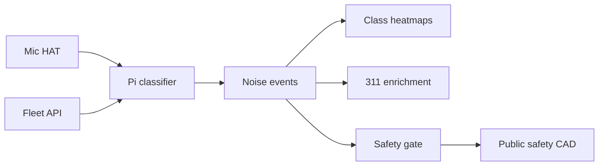

# CivicEar

**Source:** `ai-in-iot/1809.00238v1/`
**Domain:** `ai-iot`
**One-liner:** A low-cost smart-city noise classifier that labels urban sounds (jackhammer, gunshot, street music, horns) on Raspberry Pi–class nodes using MFCC + SVM/KNN — going beyond dB maps to actionable noise type.
**Wedge:** Municipal environment and public-safety units that must refresh END-style noise maps and respond to complaints, but today only store SPL averages every few years.
**Positioning:** On-node urban noise typing. WHO guidance cites bedroom <30 dB and classroom <35 dB; END 2002/49/EC demands multi-year noise maps, yet harmful events last minutes and same dB can be music or menace. CivicEar productizes MFCC features with SVM/KNN on Pi Zero W + mic HAT, ~3042 UrbanSound8K/Sound Events clips across eight classes, 85–100% accuracy, and sub-second KNN train/test on-device.

## Market research synthesis

### Thesis from source

About 85% of Swedes live in urban areas; noise affects health (sleep, teaching, heart risk, obesity, depression per cited studies). WHO recommends under 30 dB in bedrooms and under 35 dB in classrooms. EU Environmental Noise Directive 2002/49/EC requires member states to assess environmental noise and produce maps every five years. Sources change continuously (traffic, construction, music, sports), and damaging noise often lasts minutes to hours — five-year averages miss it. Critically, equal dB levels may be pleasant music or annoying/harmful noise; cities need type, not only level, so environment protection and law enforcement know jackhammer versus gunshot.

The authors implement supervised noise classification on inexpensive IoT: Raspberry Pi Zero W with ReSpeaker 2-Mic Pi HAT, MFCC features (first 12 coefficients plus frame energy), SVM and KNN classifiers with parameter sweeps (SVM γ and C; KNN k and distance metric). Dataset: 3042 samples from UrbanSound8K and Sound Events in eight classes (including gun shot, jackhammer, street music, car horn). Reported accuracy 85–100%; KNN with k=1 trains and tests in under a second on Pi Zero W for features from 3000+ samples — proving city-scale edge feasibility without cloud audio streaming.

### Buyer & economic model

- **Primary buyer:** Director of Environmental Protection or Smart City IoT programs; secondary: public-safety operations for gunshot/construction triage.
- **Users:** environmental officers, 311/complaint desks, police dispatch (policy-gated), device field techs, data scientists tuning classes.
- **Budget owner / value metric:** environmental monitoring and complaint-handling budget. Value metrics: % complaints auto-typed, map freshness (hours vs years), false gunshot rate, node cost.
- **Competing status quo:** handheld SLM surveys; fixed dB sensors without classification; cloud audio analytics that stream raw sound (privacy and backhaul cost).

### Domain constraints

- **Regulatory / trust / safety:** gunshot class errors have public-safety consequences; dual confirmation policies required before dispatch automation.
- **Data sensitivity:** continuous audio is highly sensitive; on-node classification with event metadata only is the privacy default.
- **Change-management realities:** cities cannot rip out END reporting; CivicEar must enrich maps and complaints alongside legacy dB metrics.

## Business requirements

- BR-1: Every node must report noise class and confidence together with optional SPL, not SPL alone.
- BR-2: Classification must run on-node for the default path; raw audio upload is off unless a lawful purpose and retention policy is attached.
- BR-3: Supported class taxonomy must include construction tools, traffic horns, music, and gunshot-like impulsive events, extensible per city.
- BR-4: Model packs must publish accuracy on a city holdout; promotion requires ≥85% overall with per-class floors for safety classes.
- BR-5: Gunshot (or local equivalent) detections require dual-policy: notify environment desk always; notify public safety only when confidence and corroboration rules pass.
- BR-6: Nodes must be operable on Pi-class hardware with documented train/infer time budgets.
- BR-7: Parameter sweeps (SVM γ/C, KNN k/metric) must be reproducible and stored with the model pack.
- BR-8: Complaint tickets must accept auto-suggested class with clerk override.
- BR-9: Noise maps must refresh at operator-set intervals (e.g., hourly class heatmaps) while still exporting five-year END-compatible summaries.
- BR-10: Commercial packaging prices by nodes and city zones.
- BR-11: Field techs need remote health (mic failure, Wi-Fi) without opening an SSH hobby workflow.
- BR-12: Audit logs must show overrides and public-safety notifications for contested events.

## User stories

Canonical user stories live in sibling [USER_STORIES.md](USER_STORIES.md).

## System design

### Overview

CivicEar manages city node fleets, deploys MFCC+SVM/KNN model packs, classifies audio on-node, emits typed noise events with optional SPL, feeds complaint and map systems, and gates public-safety notifications under policy.

### Actors & boundaries

- **Actors:** environmental officers, clerks, dispatchers (gated), field techs, data scientists, privacy officers, edge nodes.
- **Trust boundary:** raw audio stays on-node by default; cloud receives class events and health. Public-safety sinks are separate purpose-bound channels.
- **Human-in-the-loop points:** class override, model promotion, public-safety policy thresholds, exception audio export.

### Core capabilities

1. **Node fleet and health** — Pi-class inventory and mic health.
2. **Model packs** — MFCC + SVM/KNN with sweep metadata.
3. **On-node classification** — class + confidence (+ SPL).
4. **Event bus** — typed noise events to maps and tickets.
5. **Complaint enrichment** — suggestions with override.
6. **Public-safety gating** — corroboration rules.
7. **END/map exports** — short-interval and multi-year views.
8. **Privacy controls** — raw audio policy.

### Conceptual data

- **Primary entities:** CityZone, NoiseNode, ModelPack, NoiseEvent, ComplaintEnrichment, SafetyNotification, HealthSample, PrivacyPolicy.
- **Critical events:** classification emitted, clerk override, safety notify, model promoted, mic unhealthy, privacy exception granted.
- **Retention / audit needs:** events and overrides retained for municipal audit; raw audio ephemeral unless exception.

### Integrations (conceptual)

- **Systems of record:** 311/complaint systems, GIS noise maps, public-safety CAD (gated), device management.
- **Upstream signals:** mic HAT audio, optional calibrated SPL meters.
- **Downstream actions:** map tiles, tickets, gated alerts, work orders for construction enforcement.

### High-level architecture

### Success metrics

- **Leading:** on-node accuracy by class; % tickets auto-typed; node health uptime.
- **Lagging:** complaint resolution time; false public-safety dispatches; END map freshness; privacy incidents involving raw audio.

## OpenAPI skeleton

Canonical HTTP surface lives in sibling `openapi.yaml`. Summarize here:

- **Base path:** `/v1/...`
- **Auth:** API key and/or Bearer JWT (operator)
- **Resource groups:** Zones, Nodes, ModelPacks, Events, Complaints
