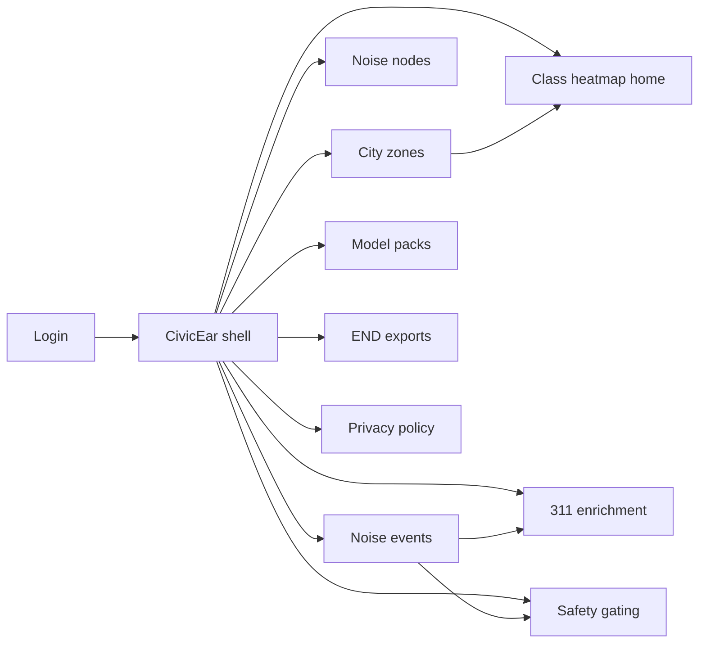
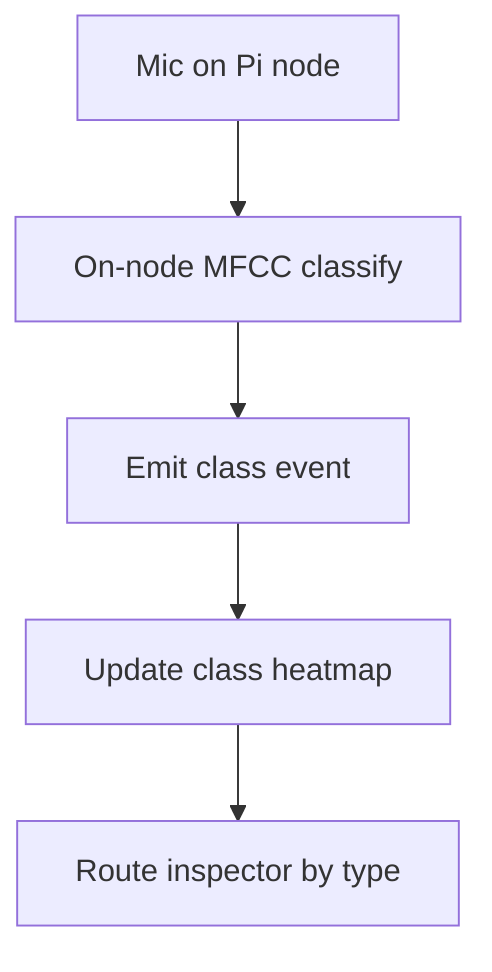
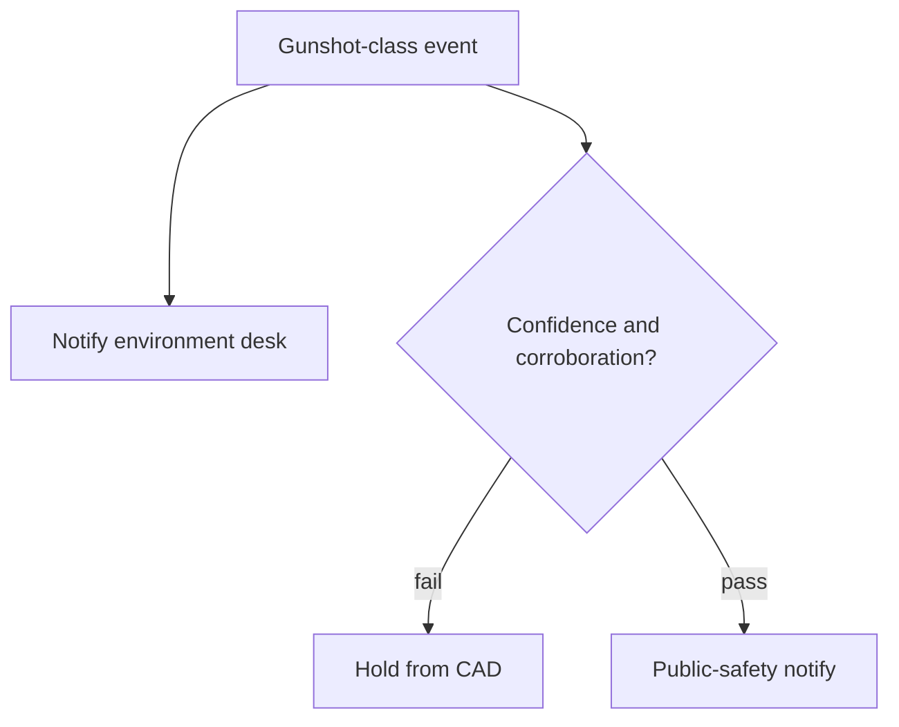

# CivicEar — Web app

**Product:** [PRODUCT.md](./PRODUCT.md)
**Primary surface:** Municipal noise-ops console (class heatmaps + complaint enrichment)
**Secondary surfaces:** END five-year export viewer; public-safety corroboration attestation (read-only)
**Design thesis:** CivicEar is a typed city ear, not a dB thermometer — the UI metaphor is a class-colored sound map where jackhammer, horn, street music, and gunshot-like events are different species. Visual language is cool concrete grey with civic teal map fills and amber construction bands on a soft dawn-ground: equal loudness never looks the same; gunshot-class cells stay sealed behind corroboration chrome until policy opens them. The brand wordmark sits as a quiet municipal seal on every map-bearing screen so officers know whose typed noise they are acting on.

## UX research synthesis

### Category peers (best-in-class)

- **SoundLevel / Brüel & Kjær Environmental software:** Calibrated SPL maps and END reporting. Steal: five-year END-compatible exports beside short-interval heatmaps; reject SPL-only as the primary municipal UX.
- **ShotSpotter / SoundThinking Respond:** Gunshot localization with dispatch workflows. Steal: corroboration and confidence before CAD notify; reject auto-dispatch on single low-confidence class hits.
- **City 311 / SeeClickFix ops consoles:** Complaint intake with routing suggestions. Steal: auto-suggested class with clerk override and audit; reject locked AI labels residents cannot contest.
- **Balena / Raspberry Pi device fleets:** Cheap node health without SSH hobbyism. Steal: mic/Wi-Fi health as first-class field-tech surface; reject developer-only device portals for city ops.

### Patterns to adopt / reject

- **Adopt:** Class + confidence (+ optional SPL) on every event; on-node default path; hourly class heatmaps + END summary export; clerk override; dual-policy gunshot notify; per-class floors before promote; parameter-sweep artifacts with packs.
- **Reject:** Continuous city audio streaming gallery; dB-only heatmaps as home; one-click police notify on music festivals; cloud-only classification as default; purple “smart city AI” dashboards; emoji class icons as the only legend.

### Trust, density, and workflow constraints from PRODUCT.md

Cities still owe END maps (BR-9) while needing minute-scale typed events — both views must coexist. Gunshot errors have safety cost (BR-5): environment desk always; public safety only after confidence + corroboration. Privacy defaults to events not raw audio (BR-2). Model packs need ≥85% with safety-class floors and reproducible SVM/KNN sweeps (BR-4, BR-6, BR-7). Complaint clerks need override with audit (BR-8, BR-12). Field techs need mic health without SSH (BR-11).

## Information architecture

### Nav model

### Roles → default home

| Role | Default home | Why |
|------|--------------|-----|
| Environmental officer | Class heatmap home | Right inspector for type (BR-1, BR-9) |
| Complaint desk clerk | 311 enrichment queue | Suggest + override (BR-8) |
| Public-safety dispatcher | Safety gating inbox | Corroborated gunshot only (BR-5) |
| Field technician | Noise nodes health | Mic/Wi-Fi before blind maps (BR-11) |
| City data scientist | Model packs | Sweeps and per-class floors (BR-4, BR-7) |
| Privacy officer | Privacy policy | Raw audio exceptions (BR-2) |

### Cross-links to OpenAPI resources

| Nav area | OpenAPI tags / resources |
|----------|---------------------------|
| City zones | Zones |
| Noise nodes, health | Nodes |
| Model packs, promote | ModelPacks |
| Noise events, safety-notify | Events |
| Complaints, override | Complaints |

## Screen inventory

### Class heatmap home

- **Purpose:** Answer “what kind of noise is where right now?” — not only how loud.
- **Entry:** Environmental officer default; zone deep link.
- **Layout regions:** Brand + zone switcher; class legend; hourly heatmap; SPL overlay toggle; live event rail; construction vs music contrast callout.
- **Primary actions:** Filter by class; open event; export hourly tile; jump to END summary.
- **Empty / loading / error:** Empty = deploy first node in zone; loading = skeleton map; error = retry with request id.
- **BR / story ties:** BR-1, BR-9; environmental officer stories.

### City zones

- **Purpose:** Partition nodes and pricing by municipal zones with purpose tags.
- **Entry:** Zones nav.
- **Layout regions:** Zone list; node count; map refresh interval; END reporting affiliation.
- **Primary actions:** Create zone; set refresh cadence; attach privacy purpose.
- **Empty / loading / error:** Empty = import GIS boundary wizard.
- **BR / story ties:** BR-9, BR-10.

### Noise node fleet and health

- **Purpose:** Operate Pi-class nodes with mic HAT and Wi-Fi health for field techs.
- **Entry:** Nodes nav; tech default.
- **Layout regions:** Node table (class last-seen, confidence, mic health, Wi-Fi); detail with train/infer budget; outdoor mount notes.
- **Primary actions:** Replace-mic work order; reboot health check; open last events.
- **Empty / loading / error:** Mic failure = coral banner with work-order CTA (no SSH instructions as primary path).
- **BR / story ties:** BR-6, BR-11.

### Noise events explorer

- **Purpose:** Typed events with class, confidence, optional SPL, nearby-node agreement.
- **Entry:** Events nav; map pin.
- **Layout regions:** Timeline; class filters; confidence; corroboration strip; audit link.
- **Primary actions:** Open safety review; attach to complaint; export event slice.
- **Empty / loading / error:** Empty = waiting for classifications; on-node path badge always visible.
- **BR / story ties:** BR-1, BR-2, BR-5.

### 311 complaint enrichment

- **Purpose:** Auto-suggest noise class on tickets with clerk override.
- **Entry:** Complaints nav; clerk default.
- **Layout regions:** Ticket queue; suggested class + confidence; override control; routing preview.
- **Primary actions:** Accept suggestion; override class; route inspector.
- **Empty / loading / error:** No suggestion = manual class required; override requires reason code.
- **BR / story ties:** BR-8, BR-12; clerk stories.

### Public-safety gating

- **Purpose:** Gunshot-class path: always log to environment; notify CAD only when confidence + corroboration pass.
- **Entry:** Safety nav; dispatcher inbox.
- **Layout regions:** Candidate queue; confidence threshold; nearby node agreement; dual-policy status; notify control.
- **Primary actions:** Notify CAD; hold; dismiss as non-safety (e.g., festival); view attestation.
- **Empty / loading / error:** Empty = no corroborated candidates (calm); single-node low confidence cannot notify.
- **BR / story ties:** BR-5; dispatcher stories.

### Model pack studio

- **Purpose:** MFCC + SVM/KNN packs with parameter sweeps, holdout metrics, per-class floors.
- **Entry:** Packs nav; scientist default.
- **Layout regions:** Pack list; sweep artifacts (γ/C, k/metric); overall ≥85% gate; safety-class floors; promote control.
- **Primary actions:** Upload/train pack; promote; rollback; compare per-class recall.
- **Empty / loading / error:** Floor fail blocks promote with class highlighted.
- **BR / story ties:** BR-3, BR-4, BR-6, BR-7.

### END export and privacy

- **Purpose:** Five-year END-compatible summaries plus raw-audio exception policy.
- **Entry:** END nav; Privacy nav.
- **Layout regions:** Summary builder; interval heatmap archive; retention policy; lawful exception requests.
- **Primary actions:** Export END pack; grant/deny raw-audio exception; set purpose separation (env vs LE).
- **Empty / loading / error:** Missing years = gap warning for compliance.
- **BR / story ties:** BR-2, BR-9; privacy officer stories.

## Key flows

1. **Typed map response** — on-node classify → event with class+confidence → heatmap update → officer sends right inspector; failure: mic unhealthy blinds zone with work order.

2. **311 enrichment** — ticket opens → suggest class → clerk accept/override with reason → route (BR-8, BR-12).

3. **Gunshot corroboration** — gunshot-class event → environment always → check confidence + nearby nodes → optional CAD notify (BR-5).

4. **Model promotion** — sweep artifacts stored → holdout ≥85% + safety floors → promote to nodes (BR-4, BR-7).

5. **Raw audio exception** — lawful request → privacy review → time-bounded export or deny (BR-2).

## Design system

### Tokens (CSS variables)

- `--color-ink: #1A2228` — primary text on dawn ground
- `--color-dawn: #E8EEF0` — app ground
- `--color-concrete: #D0D7DC` — panels
- `--color-civic: #2F6F7E` — brand / map base
- `--color-civic-bright: #3D9AAD` — active class fill
- `--color-amber-build: #C98A2E` — construction / jackhammer
- `--color-music: #5B7C5A` — street music
- `--color-impulse: #B84A42` — gunshot-class (sealed until gated)
- `--color-steel: #5C6B75` — secondary labels
- `--font-display: "Fraunces", serif` — map titles and municipal headlines
- `--font-body: "IBM Plex Sans", sans-serif`
- `--font-mono: "IBM Plex Mono", monospace` — node ids, confidence, pack versions
- `--space-1`…`--space-8`: 4px scale
- `--radius-sm: 4px`; `--radius-md: 8px`
- `--motion-heatmap-fade: 280ms ease-out` — class tile refresh
- `--motion-override: 180ms ease-out` — clerk override confirm
- `--motion-seal: 240ms ease-in-out` — safety gate unlock
- Atmosphere: soft concrete texture, dawn wash; class legend as primary color language; no purple smart-city glow.

### Typography & brand

- Display serif for zone and map titles; mono for confidence and pack ids.
- Brand seal on every map-bearing view; login: brand + “Type the noise, not just the decibels” + one CTA.

### Do / don’t

- **Do:** Pair class with confidence; keep CAD behind corroboration; clerk override with audit; END + hourly views together; mic health without SSH.
- **Don’t:** Raw audio gallery; SPL-only home; auto-dispatch on single weak hit; purple AI tiles; emoji-only legends.

### Accessibility & domain trust cues

- Class never by colour alone — text labels + patterns on heatmap.
- Live regions for safety candidates and mic failures.
- Focus: event → complaint → override → audit.
- Safety attestation machine-readable for contested events.

## Component patterns

- **ClassHeatmapTile** — typed noise cell with legend-safe patterns.
- **ClassConfidencePair** — mandatory co-display with optional SPL.
- **ClerkOverrideBar** — suggestion + reason-coded override.
- **SafetyCorroborationPanel** — confidence × nearby nodes × notify gate.
- **MicHealthBanner** — field-tech work order without SSH.
- **SweepArtifactDrawer** — SVM/KNN parameter reproducibility.
- **PerClassFloorMeter** — promote gate for safety classes.
- **EndExportPack** — five-year summary beside hourly archive.

## Out of scope for v1 web

- Full CAD replacement; continuous audio CDN; consumer complaint mobile app redesign; handheld SLM hardware UI; ML training notebook IDE; cross-city data marketplace; headset AR for inspectors.
